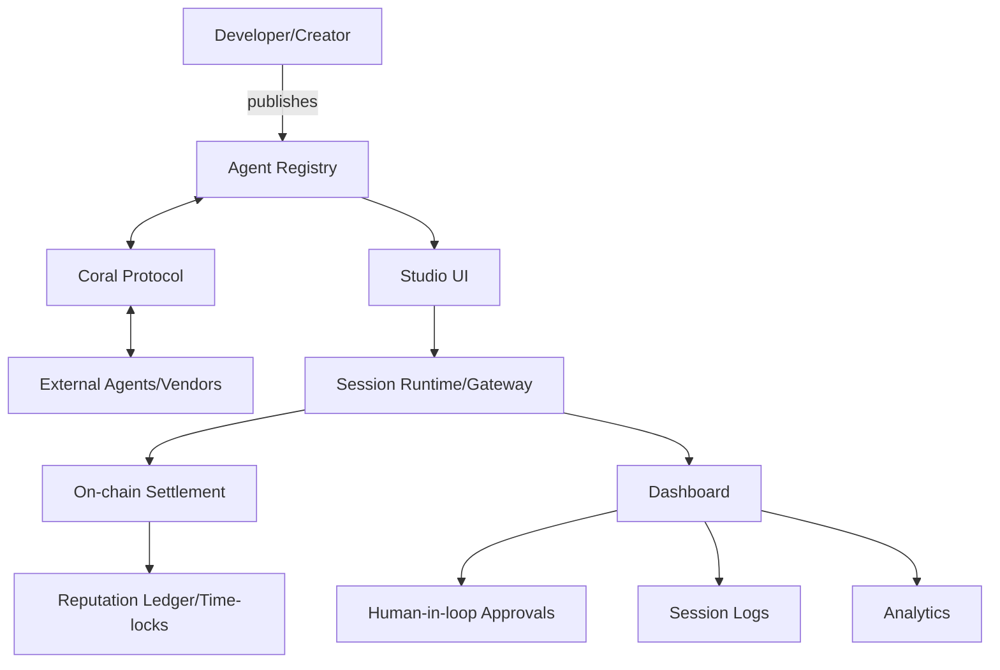

# Agent Labs OS Architecture

## 🏗️ System Architecture

### High-Level Component Overview



### Component Responsibilities

#### 1. Agent Registry
- **Purpose**: Metadata store for agent discovery and management
- **Features**:
  - Agent manifest storage (capabilities, input/output schema, pricing, stake)
  - Version control and discoverability
  - Reputation tracking
  - Similar to Hugging Face Model Hub approach

#### 2. Studio UI
- **Purpose**: Visual flow composer for agent orchestration
- **Features**:
  - Drag-and-drop agent composition
  - Visual flow designer
  - Human approval node integration
  - One-click demo deployment
  - Real-time debugging and monitoring

#### 3. Session Runtime / Gateway
- **Purpose**: Core orchestration and policy enforcement
- **Features**:
  - Agent session management
  - Policy enforcement (rate limits, consent requirements)
  - Transaction signing and mediation
  - Payment processing
  - Coral Protocol integration for multi-agent orchestration

#### 4. On-chain Settlement
- **Purpose**: Blockchain-based payment and reputation management
- **Features**:
  - Solana SPL token integration
  - Crossmint for tokenized credits
  - Micro-payment processing
  - Identity and reputation NFT minting

#### 5. Reputation & Time-locks
- **Purpose**: Trust and accountability mechanisms
- **Features**:
  - Stake tracking and slashing rules
  - Timed release of funds
  - UBI/time-lock mechanics
  - Verifiable off-chain ledger

#### 6. Dashboard
- **Purpose**: Human oversight and monitoring interface
- **Features**:
  - Human approval workflows
  - Session logging and playback
  - Voice consent integration (ElevenLabs)
  - Analytics and forensics
  - Real-time monitoring

## 🔐 Security & Data Model

### Identity Management
- **Wallet-based Identity**: Wallet addresses serve as Decentralized Identifiers (DIDs)
- **Multi-signature Support**: For enhanced security in high-value transactions
- **Identity Verification**: Optional KYC integration for compliance requirements

### Authentication & Authorization
- **Session Tokens**: Short-lived tokens for secure agent interactions
- **Coral Thread Permissions**: Thread-level access control via Coral Protocol
- **Role-based Access Control (RBAC)**: Granular permissions for different user types

### Policy Enforcement
- **Preflight Checks**: Validation before every agent action
  - `consent_required`: Human approval needed
  - `max_amount`: Transaction limits
  - `kyc_required`: Identity verification requirements
- **Rate Limiting**: Prevent abuse and ensure fair usage
- **Audit Trails**: Immutable logs for all agent interactions

### Data Privacy & Compliance
- **Encryption**: End-to-end encryption for sensitive data
- **Data Minimization**: Only collect necessary information
- **Right to Deletion**: GDPR-compliant data removal
- **Consent Management**: Granular consent tracking and management

## 🌐 Integration Architecture

### Coral Protocol Integration
```typescript
interface CoralIntegration {
  // Agent thread management
  createThread(agents: Agent[]): Promise<Thread>;
  joinThread(threadId: string, agent: Agent): Promise<void>;
  
  // Message passing
  sendMessage(threadId: string, message: Message): Promise<void>;
  receiveMessages(threadId: string): AsyncIterable<Message>;
  
  // Trust and reputation
  updateReputation(agentId: string, delta: number): Promise<void>;
  getReputation(agentId: string): Promise<number>;
}
```

### Payment Integration
```typescript
interface PaymentIntegration {
  // Micro-payments
  createPayment(amount: number, recipient: string): Promise<Payment>;
  executePayment(paymentId: string): Promise<Transaction>;
  
  // Credit management
  mintCredits(amount: number, recipient: string): Promise<void>;
  burnCredits(amount: number, holder: string): Promise<void>;
  
  // Reputation tokens
  mintReputationNFT(agentId: string, metadata: any): Promise<string>;
}
```

## 🚀 Deployment Architecture

### Development Environment
- **Local Development**: Docker Compose setup for all services
- **Hot Reloading**: Real-time development with instant feedback
- **Mock Services**: Simulated external APIs for development

### Staging Environment
- **Cloud Deployment**: Vercel/Netlify for frontend
- **Backend Services**: Heroku/Render for API services
- **Database**: Supabase for data persistence
- **Blockchain**: Solana devnet for testing

### Production Environment
- **High Availability**: Multi-region deployment
- **Load Balancing**: Distributed traffic management
- **Monitoring**: Comprehensive logging and alerting
- **Backup & Recovery**: Automated backup strategies

## 📊 Performance Considerations

### Scalability
- **Horizontal Scaling**: Stateless service design
- **Caching**: Redis for session and data caching
- **CDN**: Global content delivery for static assets
- **Database Optimization**: Indexing and query optimization

### Reliability
- **Circuit Breakers**: Prevent cascade failures
- **Retry Logic**: Exponential backoff for transient failures
- **Health Checks**: Continuous service monitoring
- **Graceful Degradation**: Fallback mechanisms for service failures

## 🔄 Data Flow

### Agent Interaction Flow
1. **Agent Discovery**: User browses registry for available agents
2. **Flow Composition**: User creates agent workflow in Studio UI
3. **Session Creation**: Runtime creates new session with policy enforcement
4. **Agent Execution**: Agents communicate via Coral Protocol
5. **Human Oversight**: Dashboard provides approval points and monitoring
6. **Settlement**: On-chain payment and reputation updates
7. **Audit**: Complete session logging and analysis

### Payment Flow
1. **Credit Check**: Verify sufficient credits for operation
2. **Payment Authorization**: User approves transaction
3. **Blockchain Transaction**: Execute payment on Solana
4. **Confirmation**: Update balances and transaction history
5. **Reputation Update**: Adjust agent reputation based on outcome

## 🛡️ Security Considerations

### Smart Contract Security
- **Audit Requirements**: All contracts must be audited
- **Upgrade Mechanisms**: Controlled upgrade paths for contracts
- **Emergency Pauses**: Ability to halt operations if needed

### API Security
- **Rate Limiting**: Prevent API abuse
- **Input Validation**: Sanitize all user inputs
- **Authentication**: Secure token-based authentication
- **CORS**: Proper cross-origin resource sharing policies

### Data Security
- **Encryption at Rest**: All sensitive data encrypted
- **Encryption in Transit**: TLS for all communications
- **Key Management**: Secure key storage and rotation
- **Access Logging**: Comprehensive access audit trails

## 📈 Monitoring & Observability

### Metrics
- **Performance Metrics**: Response times, throughput, error rates
- **Business Metrics**: Agent usage, payment volumes, user engagement
- **Security Metrics**: Failed authentication attempts, suspicious activities

### Logging
- **Structured Logging**: JSON-formatted logs for easy parsing
- **Log Aggregation**: Centralized log collection and analysis
- **Retention Policies**: Appropriate log retention for compliance

### Alerting
- **Real-time Alerts**: Immediate notification of critical issues
- **Escalation Procedures**: Clear escalation paths for different severity levels
- **Dashboard Monitoring**: Real-time system health visualization
